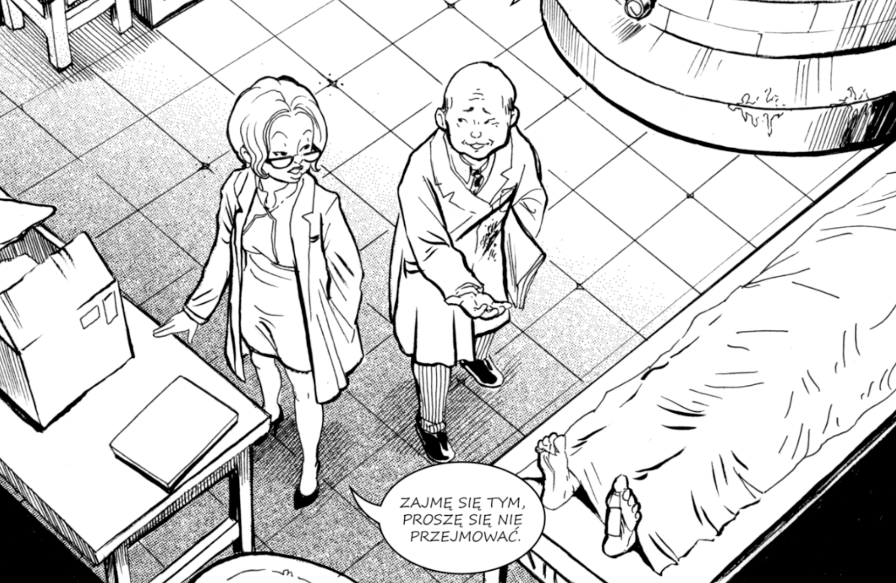
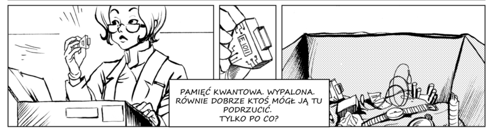
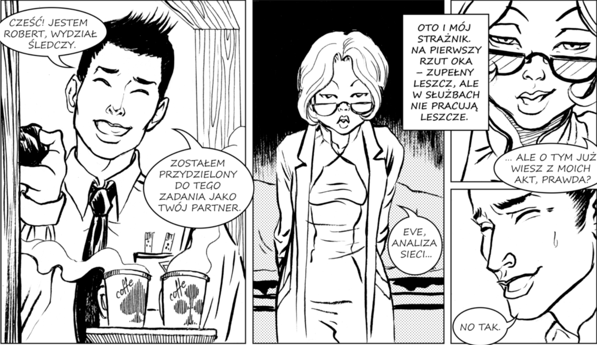
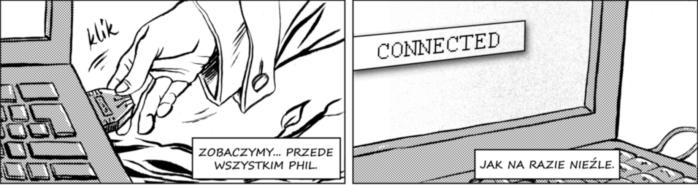
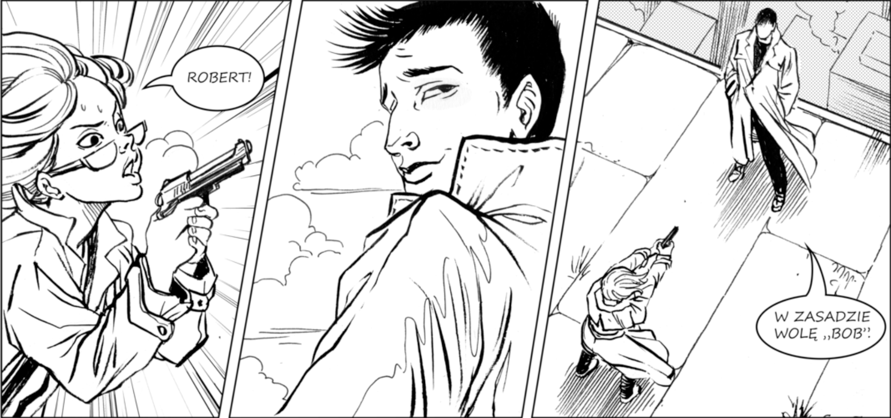
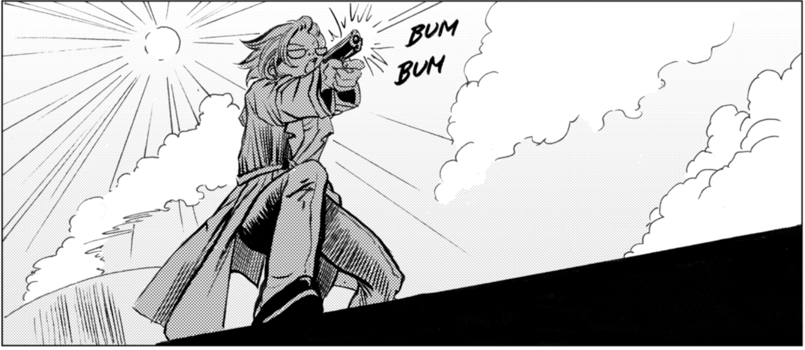
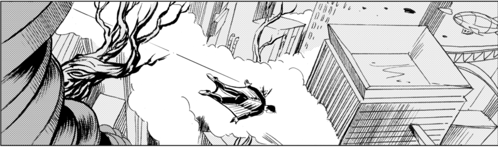
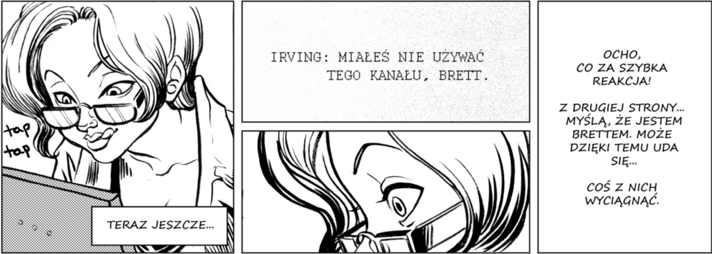
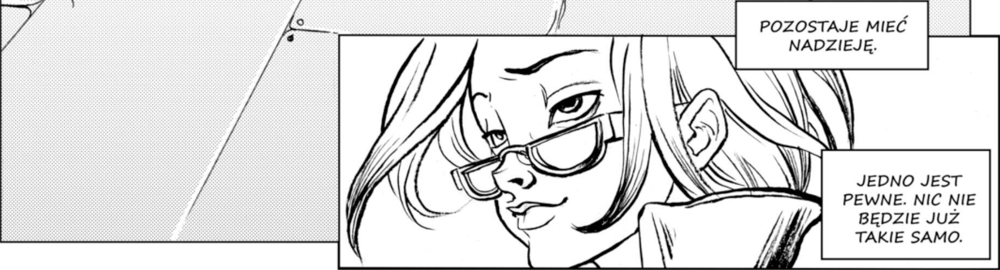

 
 

# Witamy w konkursie 'Walcz o Superpozycję'!

# Gotowa/gotowy na wyzwania?
 
 
 
 

# Nasza Agenda
 

### Etap 1 - Startujemy

----------------  | ------------- 
22 czerwca 10:00  | Rozpoczęcie zapisów do Konkursu - [https://walczosuperpozycje.pl](https://walczosuperpozycje.pl)
22 czerwca 10:00  | Rozpoczęcie dołączania do serwera Discord - [https://discord.gg/2vGWS4d3da](https://discord.gg/2vGWS4d3da)
	

### Etap 2 - Walczymy w Konkursie
	
----------------  | ------------- 
5 lipca  10:30    | Kick-off, powitanie uczestników, prezentacja zasad Konkursu
		  | [link do spotkania webex](https://bnpparibas-pl.webex.com/bnpparibas-pl/j.php?MTID=ma2fce524f523b9b238100cf7dd66eddb)
5 lipca  10:00    | Publikacja zadań pomocniczych	 		 		  
12 lipca 10:00	  | Opublikowanie zadania konkursowego
18 lipca 24:00    | Zakończenie przyjmowania rozwiązań zadania konkursowego

### Etap 3 - Podsumowanie

----------------  | ------------- 
26 lipca    10:00 | Ogłoszenie wyników Konkursu 
09 sierpnia 10:00 | Rozpoczęcie Programu Stażowego w BNP Paribas

 
 
 
 

# Ważne - zapoznaj się z instrukcją instalacji:
* [instrukcja instalacji](https://ibm.box.com/s/eswuzahyei1ivweo6sr9v7h3nxy4olfr)

 
 

# Masz pytania? Zapraszamy do dyskusji na serwerze Discord:
* [https://discord.gg/2vGWS4d3da](https://discord.gg/2vGWS4d3da)

 
 
 
 

      
 
 
 
 
 
 
 
 

## Poznaj Ewę.
    
 
 

## Ewa pracuje w Wydziale Śledczym Komendy Głównej Policji, skończyła 'Polibudę', zawsze preferowała uporządkowany świat matematyki od chaosu relacji z ludźmi. Ostatnio Ewa natknęła się na ciekawą sprawę, to seria kilku morderstw prawdopodobnie pozwiązanych ze sobą. Przy jednym z ciał znaleziono dziwne urządzenie podobne do pendrive'a, które nie reaguje na normalne systemy operacyjne. Jedno słowo w tym dochodzeniu wraca jak bumerang - "quantum". 

   
 
 

## Pomóż Ewie zrozumieć, czym są komputery kwantowe. Rozwiąż poniższe zadania:
(zadanie zostanie opublikowane 5 lipca)
* [Zadanie  pomocnicze nr 1](https://ibm.box.com/s/lrxkb7soskfuitijfehfmik2)
 
*Zadania 1 - 3 nie podlegają ocenie i nie są obowiązkowe, ale mogą pomóc Ci w przygotowaniu do zadania konkursowego (zadania nr 4)*
 
 
 
 
 

 
 
 

## To 'kwantowe' śledztwo przyciągnęło uwagę z góry. Ewa właśnie dostała partnera, który ma 'pomagać', albo wprost: szpiegować!
 
 
 

## Teraz pomóżmy Robertowi i Ewie zagłębić się w wiedzę kwantową. Rozwiąż wszystkie zadania w notatniku Epizodu 2:
(zadanie zostanie opublikowane 5 lipca)
* [Zadanie  pomocnicze nr 2](https://ibm.box.com/s/lrxkb7soskfuitijfehfmik2)
 
*Zadania 1 - 3 nie podlegają ocenie i nie są obowiązkowe, ale mogą pomóc Ci w przygotowaniu do zadania konkursowego (zadania nr 4)*
 
 
 
 
 
 
 
 
 
 
 

## Śledztwo napiera tempa. Robert znalazł w dark necie ciekawe informacje o tajemniczej oragnizacji o nazwie Alice, której celem jest ...zniszczenie komputerów kwantowych. Ewa i Robert szukają kontaktów w światku hakerskim, żeby zdobyć więcej informacji.
 

## Członkowie Alice wierzą, że rządy już pracują nad niezależną sztuczną inteligencją opartą na kwantach, która doprowadzi nas do tzw. singularity, swoistej eksplozji rozwiązań technologicznych przyćmiewająych wszystko, co do zostało wynalezione. Przy okazji (wg Alice) będzie to też koniec rodzaju ludzkiego. Aby nie dopuścić to tej sytuacji, członkowie Alice zabijają wybitnych badaczy i inżynierów zajmujących się komputerami kwantowymi!
 

## Ewa i Robert znaleźli ciekawy kontakt. Nieznajomy haker podczas rozmowy z Ewą zauważył dziwny chip znaleziony przez Ewę u jednej z ofiar i dał jej fragment kodu i wskazówki jak z tego chipa skorzytać. Ewa i Robert potrzebują kolejnej porcji wiedzy kwantowej, żeby  zhakować chip i nawiązać kontakt z członkami Alice. Pomóż im, rozwiązując ten notebook:

(zadanie zostanie opublikowane 5 lipca)
* [Zadanie  pomocnicze nr 3](https://ibm.box.com/s/lrxkb7soskfuitijfehfmik2)
 
*Zadania 1 - 3 nie podlegają ocenie i nie są obowiązkowe, ale mogą pomóc Ci w przygotowaniu do zadania konkursowego (zadania nr 4)*
 
 
 
 

## Po Twojej interwencji Ewa i Robert zdołali uruchomić chip. Chip służy członkom Alice do wewnętrznej komunikacji!
 

 
 
 
 
 
 
 
 
 
 

## Tego Ewa się nie spodziewała. Robert jest agentem wysłanym przez Alice! 
 
 
 

## Robert musiał od dawna kontrolować, co dzieje sie w Policji. Ostatnio najwyraźniej doszedł do wniosku, że Ewa stanowi zagrożenie dla działalności Alice. Chce ostrzec swoich szefów i postanawia uciec.
 
 
 

## Ostatnią szansą dla Ewy jest wykorzystanie działającego już chipa i ujawnienie kolegom z Policji tożsamości członków Alice. Należy to zrobić, zanim Robert skontaktuje się ze swoimi. Pomóż Ewie na ostatniej prostej i rozwiąż poniższe zadania:
(zadanie zostanie opublikowane 12 lipca)
* [Zadanie  konkursowe nr 4](https://ibm.box.com/s/lrxkb7soskfuitijfehfmik2)
 
 

Rozwiązanie zadania konkursowego prześlij klikając poniższy link:
* [PRZEŚLIJ ROZWIĄZANIE](https://ibm.ent.box.com/f/4c9101c0616f4897920a02a67d077321)
 
 
 
 
 
     

## Gratulacje.
## Dokonałeś tego! Tożsamość członków organizacji Alice została ujawniona i wszyscy będą aresztowani. Przyszłość komputerów kwantowych jawi się teraz w znacznie ciekawszych barwach. Ty też możesz budować tą przyszłość. Zaangażuj się i spraw, aby przewaga kwantowa stała się rzeczywistością! 
 

 
 
 
 
 
 
 
 
 
 
 
 
 
 
 
 
 
 
###### Ilustracje przygotowane na podstawie komiksu „Rewolucja stanu – fantastyczne wprowadzenie do informatyki kwantowej” (https://depot.ceon.pl/handle/123456789/16807) autorstwa Katarzyny Kary, Michała Cholewy i Piotra Gawrona wydanego przez Instytut Informatyki Teoretycznej i Stosowanej PAN w Gliwicach udostępnionego na licencji CC-BY 4.0 (https://creativecommons.org/licenses/by/4.0/deed.pl).
